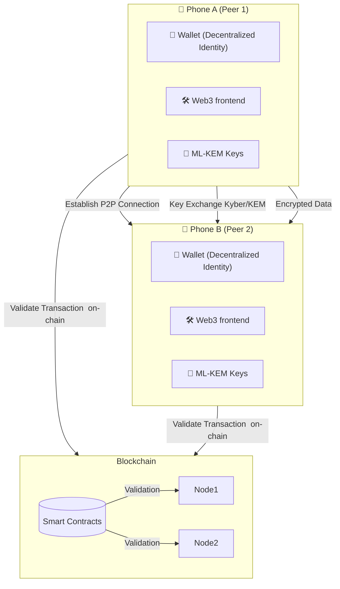

## Decentralized blockchain-based chat app using post-quantum cryptography
This is a Python-based blockchain project that integrates post-quantum key exchange algorithms (ML-KEM and CRYSTALS-Kyber) using the Kyber-Python library.

Proof of Work (PoW) is a great concept for decentralization and security , but it's also computationally expensive and can be very slow. For that reason, i chose to implement Proof of Authority (PoA)

[Wikipedia Proof-of-authority](https://en.wikipedia.org/wiki/Proof_of_authority)

| Feature                                                       | Status |
| :------------------------------------------------------------ | :----: |
| Only real users can send messages                             | Yes    |
| Miners can’t forge or alter transactions                      | Yes    |
| Proof of Authority ensures only trusted miners can mine       | Yes    |
| Secure against fake transactions                              | No     |